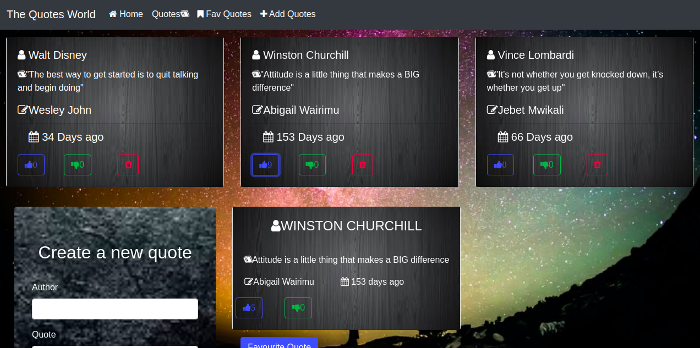

# Quotes

## Author
Stephen Nderitu

## Description
This is an app where one creates quotes.The  quotes  can be liked or disliked based on the user interacting with the page.One can also be able to delete a quote.
## Project Image

## Behaviour Driven Development (BDD)
| Behavior | Input Example- When it receives: | Output Example- It should return: |
| :-------------: | :-------------: | :-------------: |
| Create a quote | Live your life to inspire | Display quote: "Live your life to inspire" |
| Delete a quote | Delete Action | Deleted Quote is wiped from the quotes in the browser |
| Like a Quote | Like action | Likes count increase by one.|
| Dislike a Quote |Dislike action | Dislike increases by one |
| Favorite quote | User clicks on the favorite quote button | favorite quote is displayed and highlighted|

### Live Link

* https://Steve99-coder.github.io/Quotes-App/

## Installation

### Step 1:

* install node js [here](https://nodejs.org/en/).

* Install angular with angular cli.[guide](https://codeburst.io/how-to-build-an-angular-app-with-angular-cli-in-a-couple-of-minutes-43089d3ab272) with worked well for me

### Step 2: 

* **git clone https://github.com/Steve99-coder/Quotes-App.git** to your terminal and execute it by opening with vsCode or any other IDE of your choice.

### Step 3:
Run `ng serve` for a dev server. Navigate to `http://localhost:4200/`. The app will automatically reload if you change any of the source files.## Development server

## Code scaffolding

Run `ng generate component component-name` to generate a new component. You can also use `ng generate directive|pipe|service|class|guard|interface|enum|module`.

## Build

Run `ng build` to build the project. The build artifacts will be stored in the `dist/` directory. Use the `--prod` flag for a production build.

### License

 [[License: MIT]](Licence.md)

